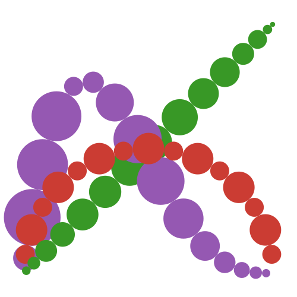

# Misc.

## About the logo


* The center points of circles are generated from nodes(x-axis) and weights(y-axis) of Gaussian quadrature.
    * Number of points : `n = 15`
    * ``\textcolor{#CB3C33}{\text{\textbf{Red}}}`` : `gausslegendre(n)`
    * ``\textcolor{#389826}{\text{\textbf{Green}}}`` : `gausschebyshev(n, 3)`
    * ``\textcolor{#9558B2}{\text{\textbf{Purple}}}`` : `gaussjacobi(n, 5/2, 1/2)`
* These colors are from [julia-logo-graphics](https://github.com/JuliaLang/julia-logo-graphics).
* The logo is generated with [Luxor.jl](https://github.com/JuliaGraphics/Luxor.jl), and its source code is [here](https://github.com/JuliaApproximation/FastGaussQuadrature.jl/blob/master/docs/logo.jl).


## Other docstrings from private methods

```@autodocs
Modules = [FastGaussQuadrature]
Private = true
Public = false
```
